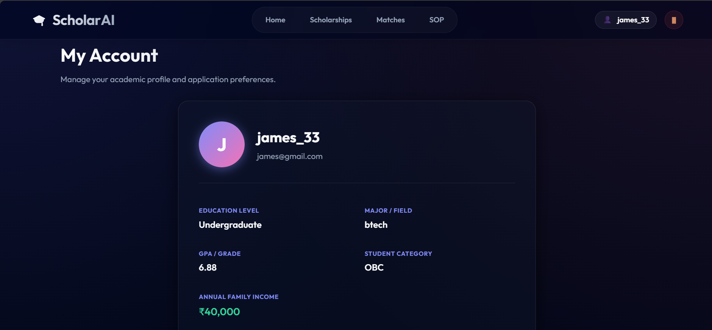
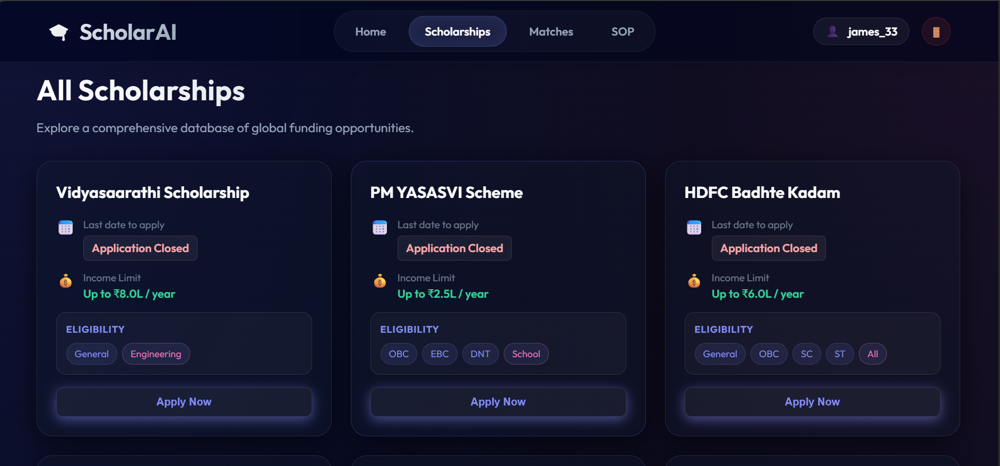
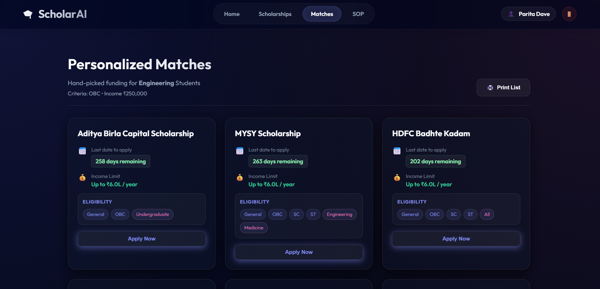
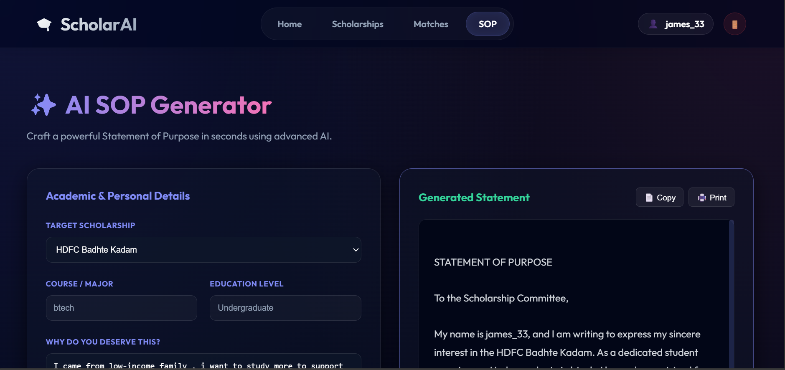

# 🎓 ScholarAI – Intelligent Scholarship Finder

ScholarAI is an intelligent web application designed to help students find scholarships that match their personal and academic profile.  
It combines automated web scraping, strict eligibility matching, and an AI-powered SOP (Statement of Purpose) generator.

---


## 📌 Project Overview

Students often miss suitable scholarships due to scattered information and complex eligibility criteria.  
ScholarAI solves this problem by:

- Automatically collecting scholarship data
- Showing only strictly eligible scholarships
- Helping students generate professional SOPs using AI

### 📸 Application Screenshots

| Home Page                        |User Profile                       | All Scholarships                         |
|----------------------------------|----------------------------------------|-------------------------------------|
|  |  | |

| Matches                                                  | SOP Generator                  |
|----------------------------------------------------------|--------------------------------|
|   |  |


---


## 🏗️ Architecture

ScholarAI follows a Client–Server architecture.

## ✨ Key Features

### 🔐 User Authentication
- User registration with academic profile:
  - Income
  - Category
  - Course
  - GPA
- Secure login
- Data persistence using SQLite

### 🔍 Scholarship Matching (Strict)
Scholarships are filtered based on:
- User income ≤ scholarship income limit
- User category must be allowed

Eligible scholarships are ranked using:
- Course relevance
- AI-based relevance boost

### 📝 AI SOP Generator
- Generates a professional Statement of Purpose
- Based on user achievements and selected scholarship
- Powered by:
  - Google Gemini API
  - OpenAI API (fallback)

### 🤖 Scholarship Scraper
- Automatically scrapes scholarship data from external sources
- Extracts:
  - Scholarship name
  - Income limit
  - Allowed categories
  - Allowed courses
  - Deadline
- Built using Puppeteer and Cheerio

## 🛠️ Technology Stack

### Frontend
- React.js
- Vite
- React Router
- Axios

### Backend
- Node.js
- Express.js
- SQLite (sqlite3, sqlite)
- Puppeteer
- Cheerio
- Nodemailer
- Google Gemini API
- OpenAI API

---
### Database
- SQLite
- Stores users, scholarships, and applications

---

## 📁 Project Structure
```
ScholarAI/
├── client/        # React frontend
├── server/        # Node.js backend
└── README.md
```

---

## 🚀 How to Clone and Run the Project

### 1. Clone the Repository
```bash
git clone https://github.com/<your-username>/ScholarAI.git
```

### 2. Navigate to Project Directory
```bash
cd ScholarAI
```

### 3. Backend Setup
```bash
cd server
npm install
npm start
```
Backend runs on: `http://localhost:5000`

### 4. Frontend Setup
Open a new terminal:
```bash
cd client
npm install
npm run dev
```
Frontend runs on: `http://localhost:5173`

---

## 🔑 Environment Variables

Create a `.env` file inside the `server` directory:
```env
PORT=5000
GEMINI_API_KEY=your_gemini_api_key
OPENAI_API_KEY=your_openai_api_key
EMAIL_USER=your_email
EMAIL_PASS=your_email_password
```

---

## 👥 Contributors

- **Trushi Jasani** – Web Scraping & Frontend Development
- **Parita Dave** –  AI Model for Scholarship Matching & Backend
- **Ayushi Vadariya** – Project Lead

---

## 🤝 Contribution & Suggestions

Contributions and suggestions are welcome!

